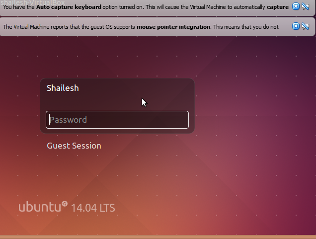

# 🖥️ Linux Server Setup & Web Hosting

## 📌 Project Overview

Deployed a Linux-based web server using Ubuntu in a virtualized environment and hosted a static website using Apache.

This project demonstrates hands-on experience with Linux administration, web server configuration, and basic networking.

---

## 🎯 Objectives

* Install and configure Ubuntu Server
* Set up Apache web server
* Host a website accessible via browser
* Configure firewall and verify connectivity

---

## 🛠️ Technologies Used

* Ubuntu Server (20.04/22.04)
* Apache Web Server
* VirtualBox
* Linux CLI (systemctl, apt, ip)
* UFW Firewall

---

## ⚙️ Implementation Steps

### 1. Virtual Machine Setup

* Created VM using VirtualBox
* Installed Ubuntu Server
* Allocated resources (2GB RAM, 20GB storage)

### 2. Server Configuration

* Updated system packages
* Installed essential tools (net-tools, curl)

### 3. Apache Installation

* Installed Apache using apt
* Enabled and started service

### 4. Website Deployment

* Created HTML file in /var/www/html
* Hosted a simple static webpage

### 5. Firewall Configuration

* Enabled UFW firewall
* Allowed Apache traffic

---

## 📸 Screenshots

### 🖥️ Virtual Machine Running

### ⚙️ Apache Service Status

### 🌐 Website Hosted

### 🌍 IP Address Configuration

### 🔐 Firewall Status

---

## 🔍 Key Learnings

* Linux system administration basics
* Service management using systemctl
* Web server setup and hosting
* Network troubleshooting and IP configuration
* Firewall and security basics

---

## 🚀 Future Improvements

* Configure Nginx as reverse proxy
* Add SSL using Let's Encrypt
* Deploy on AWS EC2
* Connect custom domain

---

## 💼 Author

Shubham Mane
